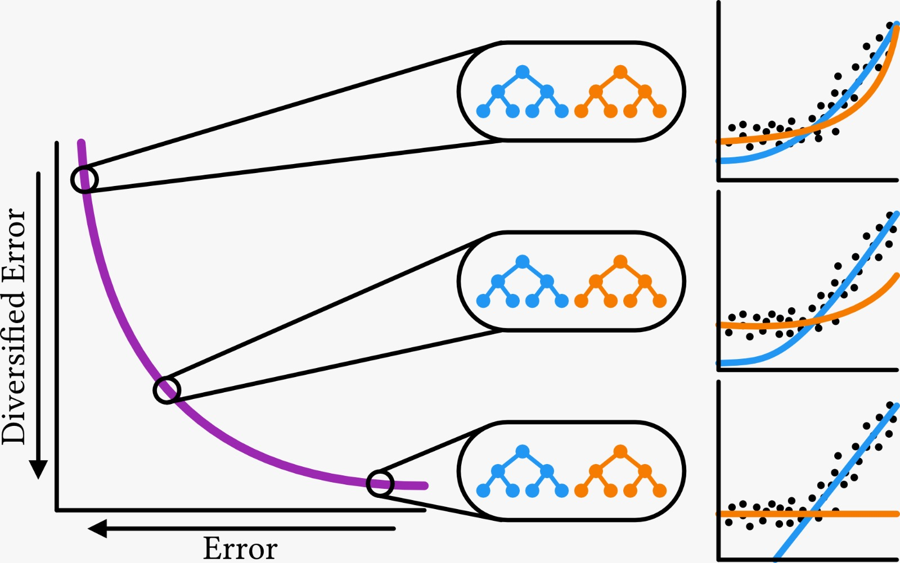

<!-- DID YOU GET YOUR FEET BACK? -->

# Multi-modal multi-objective genetic programming
Explainable artificial intelligence (XAI) is an important and rapidly expanding research topic. The goal of XAI is to gain trust in a machine learning (ML) model through clear insights into how the model arrives at its predictions. Genetic programming (GP) is often cited as being uniquely well-suited to contribute to XAI because of its capacity to learn (small) symbolic models that have the potential to be interpreted. Nevertheless, like many ML algorithms, GP typically results in a single best model. However, in practice, the best model in terms of training error may well not be the most suitable one as judged by a domain expert for various reasons, including overfitting, multiple different models existing that have similar accuracy and unwanted errors on particular data points due to typical accuracy measures like mean squared error. Hence, to increase chances that domain experts deem a resulting model plausible, it becomes important to be able to explicitly search for multiple, diverse, high-quality models that trade-off different meanings of accuracy. In this paper, we achieve exactly this with a novel multi-modal multi-tree multi-objective GP approach that extends a modern model-based GP algorithm known as GP-GOMEA that is already effective at searching for small expressions.



*Visulisation of the approach.*

## Related research work
This package represents the code supplement to the paper titled “Multi-modal multi-objective model-based genetic programming to find multiple diverse high-quality models”,
authored by Evi Sijben, Tanja Alderliesten and Peter Bosman, which has been published in the proceedings of GECCO 2022.

If you use our code for academic purposes, please support our research by citing:
```
@inproceedings{sijben2022multi,
title={Multi-modal multi-objective model-based genetic programming to find multiple diverse high-quality models},
author={Sijben, EMC and Alderliesten, Tanja and Bosman, Peter AN},
booktitle={Proceedings of the Genetic and Evolutionary Computation Conference},https://github.com/EviSijben/3M-GOMEA/blob/master/overview.jpeg
pages={440--448},
year={2022}
}
```


## Installation
to install the needed dependencies on ubuntu run `chmod +x deps_ubuntu; sudo ./deps_ubuntu` (or `chmod +x deps_fedora; sudo ./deps_fedora` for fedora).

The project is built using CMake. Run `make` (or `make debug` for a debug build). If you have `ninja-build` installed, you can use it to speed up builds, by prefixing the make command with `GEN=ninja` (e.g. `GEN=ninja make release`).

## C++ executable
After running `make`, you will find a C++ executable called `main` in `build/release/src/` that you can run using a parameter setting file, for example, `./build/release/src/main --file params_gomea_multimodal.txt`.

### Data set structure
Datasets must be organized as follows; each row is an example, and each column is a feature, with exception for the last column, which is the target variable. Values should be separated by spaces. Do not include any textual header.
Data sets used in the paper can be found at https://goo.gl/9D2z3b. 

### Results output
Every generation, the solutions on the approximation front are saved to a file 'mo_archive_genXXX.csv' with XXX the generation number. This file is stored in the 'results' folder. 

## Acknowledgements
This code is an extension to Marco Virgolin's package [GP-GOMEA](https://github.com/marcovirgolin/GP-GOMEA).


